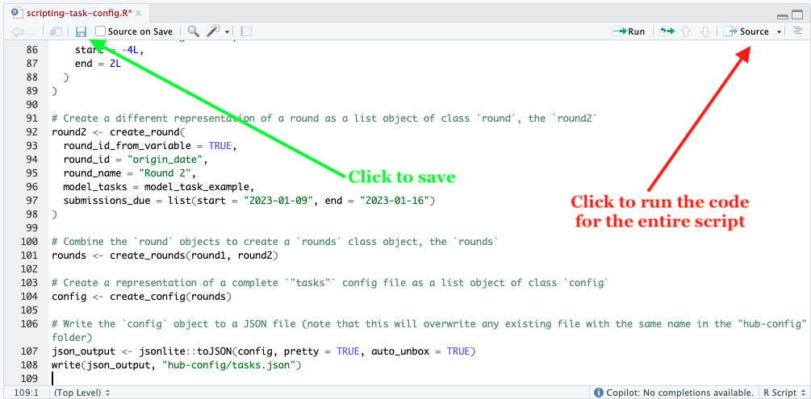

```{r, setup, include = FALSE}
knitr::opts_chunk$set(
  collapse = TRUE,
  comment = "#>"
)
```
## Introduction

The `tasks.json` configuration file is a the source of truth for validating a
hub and is also one of the most complex aspects of a hub. This configuration
file is a formal representation of an official collaborative forecasting
challenge that allows direct and unambiguous evaluation and comparison of model
outputs. It allows hub administrators to set a clear standard for model
submissions.

Creation of this configuration file is not easy, however---and it should not
be easy because setting a hub up for success requires a lot of care in
understanding what you are attempting to model. This includes knowledge of
what factors are important as modeling parameters and what is the best
representation of model outputs that allows for effective evaluation and
summarization so decisions can be made quickly.

While we provide [a hubTemplate](https://github.com/hubverse-org/hubTemplate/)
for use to get started with setting up a hub, JSON files are easy for a computer
to read, but not so easy for a human to read and less so to write. The hard part
of creating a `tasks.json` file should be what model parameters to use, not
constantly looking at JSON syntax or hunting down a missing comma.

In this vignette, we will use the config creation functions in `hubAdmin` to
create a `tasks.json` file that represents two rounds of a modeling effort to
predict influenza hospitalizations and optionally deaths 1 to 4 weeks ahead
with mean, median, and quantile predictions in the US, and optionally 5 states.

Before getting to the scripting, it's important to get a general look at what
a `tasks.json` file looks like structurally.

## Structure of a `tasks.json` configuration file

The structure of a `tasks.json` configuration file roughly looks like the
diagram below:

```
tasks.json
├─schema_version: "https://.../v4.0.0/tasks-schema.json"
├─rounds:
│ └─model_tasks:
│   ├─target_metadata:
│   │ └─[...]
│   ├─task_ids:
│   │ └─[...]
│   └─output_type:
│     └─[...]
├─round_id_from_variable: true
├─round_id: origin_date
├─submissions_due:
│ └─[...]
├─output_type_id_datatype: "auto"
└─derived_task_ids:
  └─[...]
```

The first item in a `tasks.json` file is the `schema_version`, which provides
a URL to a schema that validates the file is in the expected structure.
It then defines the **rounds** that sets the cadence of the model submissions.
These rounds contain one or more [**modeling
tasks**](https://hubverse.io/en/latest/user-guide/tasks.html) that define the
expected content of a model submission against one or more modeling targets.
Each modeling task includes three elements:

 - `target_metadata`: characteristics for each target (an example of a modeling
   target is "Daily incident Flu Hospitalizations")
 - `task_ids`: a collection of variables that can be used for modeling efforts.
   **Each unique combination of task IDs represents a single modeling task**.
 - `output_type`: the expected model output representation

## Creation of a `tasks.json` file

To create the `tasks.json` file, we will start from the inside out. This means
that we will create the `target_metadata`, `task_ids`, `output_type`s first.
We will then use those to create two `model_task` objects and then bundle them
into two `round` objects, which will be inserted into a `config` object.

### Creating the `target_metadata` objects

The `target_metadata` provides both human-readable (`target_name` and
`target_units`) and machine-readable (e.g. `target_type` and `is_step_ahead`)
information about the targets.

```{r create-target-metadata}
# Load the hubAdmin package
library(hubAdmin)
# Create a representation of a `target_metadata` item as a list object of class `target_metadata_item`, the `target_metadata_hosp` that will hold the metadata for the target of incident influenza hospitalizations
target_metadata_hosp <- create_target_metadata_item(
  target_id = "inc hosp",
  target_name = "Weekly incident influenza hospitalizations",
  target_units = "rate per 100,000 population",
  target_keys = list(target = "inc hosp"),
  target_type = "discrete",
  is_step_ahead = TRUE,
  time_unit = "week"
)

# Create a representation of a `target_metadata` item as a list object of class `target_metadata_item`, the `target_metadata_death`, that will hold the metadata for the target of incident influenza deaths
target_metadata_death <- create_target_metadata_item(
  target_id = "inc death",
  target_name = "Weekly incident influenza deaths",
  target_units = "rate per 100,000 population",
  target_keys = list(target = "inc death"),
  target_type = "discrete",
  is_step_ahead = TRUE,
  time_unit = "week"
)

# Combine the `target_metadata_item` objects to create a `target_metadata` class object, the `target_metadata_example`
target_metadata_example <- create_target_metadata(target_metadata_hosp, target_metadata_death)
```

If you inspect the `target_metadata_hosp` object, you will see that it appears
as a class `target_metadata_item` with additional attributes about the schema
that created it:

```{r tmh}
str(target_metadata_hosp)
```


Likewise, `target_metadata_example` is a combination of `target_metadata_hosp`,
and `target_metadata_death`:


```{r, tme}
str(target_metadata_example)
```


If this creates lists with metadata, then why bother creating a function at all?
Ah, but you forget that people are fallible and it's easy to make mistakes. For
example, some of the values are interdependent and if you accidentally leave one
out, the function will provide a helpful error:

```{r tmh-example}
#| error: true
create_target_metadata_item(
  target_id = "inc hosp",
  target_name = "Weekly incident influenza hospitalizations",
  target_units = "rate per 100,000 population",
  target_keys = list(target = "inc hosp"),
  target_type = "discrete",
  is_step_ahead = TRUE
)
```


### 4.1. Creating the `task_id` objects

```{r set-task-ids}

# Create a representation of a task ID item as a list object of `class task_id`, the `origin_date_id`
origin_date_id <- create_task_id(
  "origin_date",
  required = NULL,
  optional = c("2023-01-02", "2023-01-09", "2023-01-16")
)

# Create a representation of a task ID item as a list object of `class task_id`, the `location_id`
location_id <- create_task_id(
  "location",
  required = "US",
  optional = c("01", "02", "04", "05", "06")
)

# Create a representation of a task ID item as a list object of `class task_id`, the `horizon_id`
horizon_id <- create_task_id("horizon", required = 1L, optional = 2:4)

# Create a representation of a task ID item as a list object of `class task_id`, the `target_id`
target_id <- create_task_id("target", required = "inc hosp", optional = "inc death")

# Combine the `task_id` objects to create a `task_ids` class object, the `task_ids_example`
task_ids_example <- create_task_ids(origin_date_id, location_id, horizon_id, target_id)

```

### 4.2. Creating the `output_type` objects

Write or copy the lines of code written below after the `task_id` objects in your `scripting-task-config.R` file.

```{r create-output-type-ids}
# Create a representation of a `mean` output type as a list object of class `output_type_item`
mean_example <- create_output_type_mean(
  is_required = TRUE,
  value_type = "double",
  value_minimum = 0L
)

# Create a representation of a `median` output type as a list object of class `output_type_item`
median_example <- create_output_type_median(
  is_required = FALSE,
  value_type = "integer",
  value_minimum = 0L

)

# Create a representation of a `quantile` output type as a list object of class `output_type_item`
quantile_example <- create_output_type_quantile(
  required = c(0.25, 0.5, 0.75),
  is_required = TRUE,
  value_type = "double",
  value_minimum = 0
)

# Combine the point estimate `output_type_item` objects to create an `output_type` class object, the `output_type_example1`
output_type_example1 <-  create_output_type(mean_example, median_example)

# Combine the other `output_type_item` objects to create an `output_type` class object, the `output_type_example2`
output_type_example2 <- create_output_type(mean_example, quantile_example)
```

### 4.4. Creating the `model_task` objects

Write or copy the lines of code written below after the `target_metadata` objects in your `scripting-task-config.R` file.

```{r create-model-task}
#Create an object of class `model_task` representing a model task, the `model_task_hosp`
model_task_hosp <- create_model_task(
  task_ids = task_ids_example,
  output_type = output_type_example1,
  target_metadata = target_metadata_example
)

#Create another object of class `model_task` representing a similar model task, the `model_task_death`
model_task_death <- create_model_task(
  task_ids = task_ids_example,
  output_type = output_type_example2,
  target_metadata = target_metadata_example
)

# Combine the `model_task` objects to create a `model_tasks` class object, the `model_task_example`
model_task_example <- create_model_tasks(model_task_hosp, model_task_death)
```

### 4.5. Creating the `round` objects

Write or copy the lines of code written below after the `model_task` objects in your `scripting-task-config.R` file.

```{r create-rounds}
# Create a representation of a round as a list object of class `round`, the `round1`
round1 <- create_round(
  round_id_from_variable = TRUE,
  round_id = "origin_date",
  round_name = "Round 1",
  model_tasks = model_task_example,
  submissions_due = list(
    relative_to = "origin_date",
    start = -4L,
    end = 2L
  )
)

# Create a different representation of a round as a list object of class `round`, the `round2`
round2 <- create_round(
  round_id_from_variable = TRUE,
  round_id = "origin_date",
  round_name = "Round 2",
  model_tasks = model_task_example,
  submissions_due = list(start = "2023-01-09", end = "2023-01-16")
)

# Combine the `round` objects to create a `rounds` class object, the `rounds`
rounds <- create_rounds(round1, round2)
```

### 4.6. Creating and saving the `tasks` config file

Write or copy the lines of code written below after the `round` objects in your `scripting-task-config.R` file.

```{r create-tasks, eval = FALSE}
# Create a representation of a complete `"tasks"` config file as a list object of class `config`
config <- create_config(rounds)

# Write the `config` object to a JSON file (note that this will overwrite any existing file with the same name in the "hub-config" folder)
write_config(config, overwrite = TRUE)
```

```
#> ✔ `config` written out successfully.
```


<details>
<summary>contents of `hub-config/tasks.json`</summary>

````json

```{r}
#| results: asis
#| echo: false
tmp <- tempfile()
config <- create_config(rounds)
write_config(config, config_path = tmp, overwrite = TRUE, silent = TRUE)
writeLines(readLines(tmp))
```

````

</details>


## Step 5: Save and run the script

Click on the "save" icon to save the script. Then, click on the "Source" icon to run the script.

```{r}
#| results: asis
#| echo: false
#| alt: 'Screenshot for saving and running the `scripting-task-config` script in RStudio'

```

